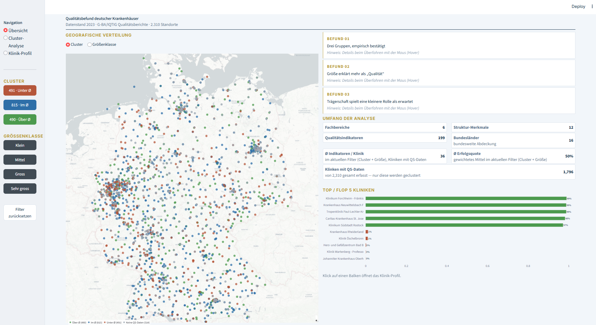
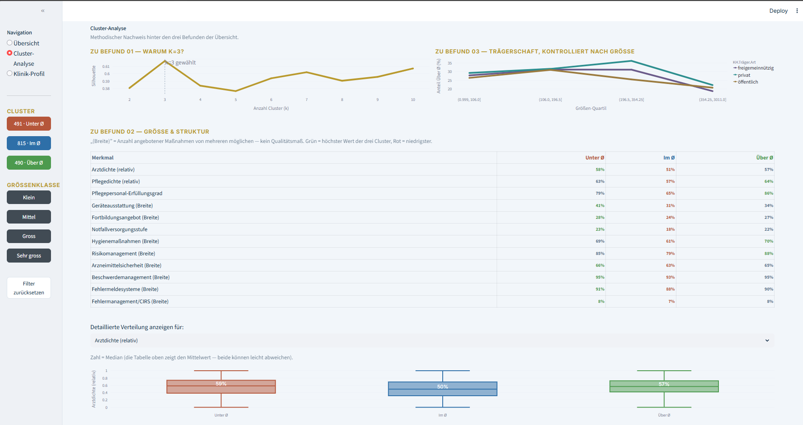
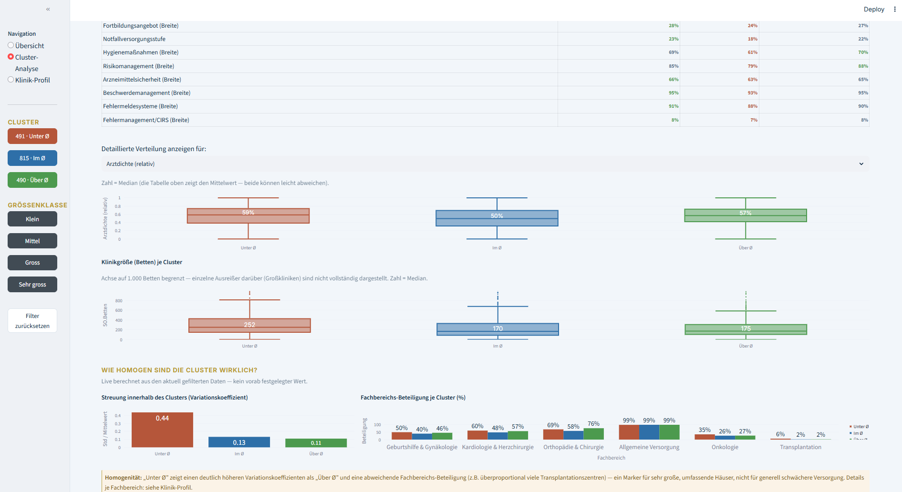
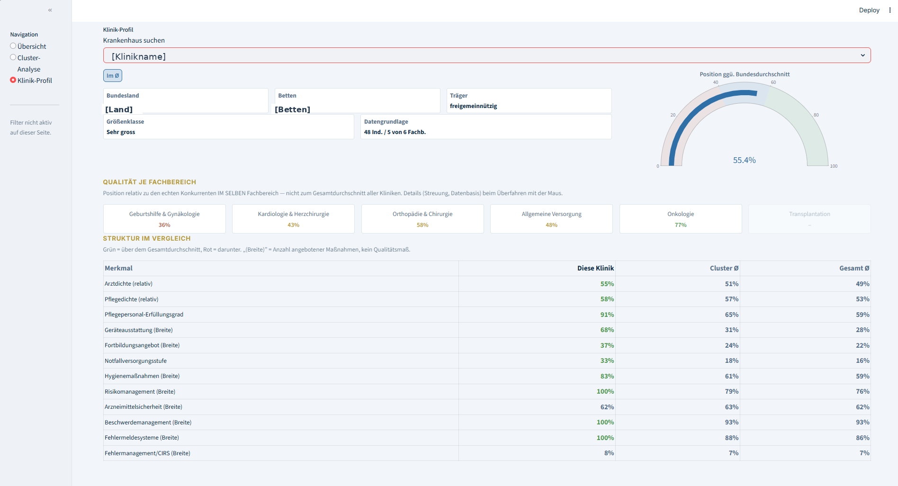

# Qualitätsbefund deutscher Krankenhäuser

Eine Analyse der Qualität deutscher Krankenhäuser, basierend auf strukturierten Qualitätsdaten aus dem Gesundheitssektor 2023.

---

## Worum geht es?

Rund 2.300 deutsche Krankenhäuser werden anhand ihrer Qualitätsdaten in drei Gruppen eingeteilt:

- **Über Ø** – Ergebnis über dem Bundesdurchschnitt
- **Im Ø** – Ergebnis im Durchschnitt
- **Unter Ø** – Ergebnis unter dem Bundesdurchschnitt

Die Namen sind bewusst neutral. Sie zeigen nur die Position im Vergleich – kein Urteil "gut" oder "schlecht" (siehe Grenzen der Methode unten).

## Screenshots

**Übersicht** — zentrale Befunde, Karte, KPI-Kacheln:


**Cluster-Analyse** — methodischer Nachweis (Elbow/Silhouette, Validierung):



**Klinik-Profil** — Einzelansicht mit Fachbereichs-Kacheln:


## Wie wurde gerechnet?

```
Rohe Daten (417.000 Zeilen, 60 % Duplikate)
        │
        ▼
Daten bereinigen (Duplikate raus, kaputte Werte repariert)
        │
        ▼
Kennzahlen berechnen
  – getrennt nach 6 Fachbereichen (jeder hat ein anderes "normales" Niveau)
  – kleine Fallzahlen werden vorsichtig behandelt
  – am Ende: EIN Qualitätswert pro Klinik
        │
        ▼
Gruppen bilden (Anzahl nicht geraten, sondern berechnet: Elbow + Silhouette)
        │
        ▼
Dashboard
```

## Die drei wichtigsten Ergebnisse

1. **Drei Gruppen sind statistisch gut begründet** (Silhouette-Score = 0,617 – die beste Wahl, nicht nur die einfachste).
2. **Größe der Klinik spielt eine große Rolle.** Große Kliniken landen häufiger "Unter Ø" – wahrscheinlich weil sie schwierigere Fälle behandeln, nicht weil die Behandlung schlechter ist.
3. **Trägerschaft (privat/öffentlich) spielt eine kleinere Rolle als es auf den ersten Blick scheint.** Ein Teil des Unterschieds ist ein Größen-Effekt (private Kliniken sind im Schnitt kleiner) – aber auch nach Kontrolle nach Klinikgröße bleibt "privat" in jeder Größenklasse leicht vorne. Details und Zahlen dazu im Code, `03_cluster.py`.

## Technik

Python (pandas, NumPy, scikit-learn) für die Berechnung, Streamlit + Plotly für das Dashboard.

## Projektaufbau

```
├── 0_cleanup.py           # räumt die rohen Qualitätsindikator-Daten auf
├── 01_extract.py          # liest alle 86 CSV-Dateien ein
├── 02_transform.py        # berechnet die Kennzahlen
├── 03_cluster.py          # bildet die 3 Gruppen
├── app_analyst.py         # Dashboard
└── data/                  # Rohdaten & Ergebnisse – NICHT enthalten (siehe unten)
```

## Selbst ausführen

```bash
pip install pandas numpy scikit-learn streamlit plotly

python 0_cleanup.py
python 01_extract.py
python 02_transform.py
python 03_cluster.py
streamlit run app_analyst.py
```

Dafür müssen die 86 Rohdaten-Dateien im Ordner `data/raw/` liegen.

## Wo kommen die Daten her – und warum sie hier nicht dabei sind

**Dieses Repository enthält keine echten Daten.**

Die verwendeten Qualitätsdaten wurden im Rahmen einer Weiterbildung über eine Partnerorganisation bereitgestellt und unterliegen deren Nutzungsbedingungen – sie sind nicht zur Weiterverbreitung gedacht und daher nicht im Repository enthalten.
Wer selbst testen möchte, kann eigene Testdaten mit gleicher Spaltenstruktur nutzen.

## Zwei wichtige Korrekturen in der Berechnung

Ein einfacher, ungewichteter Durchschnitt aller Qualitätsindikatoren pro Klinik klingt naheliegend — funktioniert aber nicht gut. Zwei Probleme mussten zuerst gelöst werden:

**1. Rauschen bei kleinen Fallzahlen**

Eine Klinik mit nur 3 gemeldeten Indikatoren kann durch einen einzigen ungünstigen Wert (reiner Zufall, keine echte Schwäche) auf 0 % abstürzen oder auf 100 % springen. Das ist kein Qualitätssignal, sondern Stichprobenrauschen. Lösung: **Shrinkage** (Empirical-Bayes-Ansatz) — der Wert einer Klinik wird leicht in Richtung des Durchschnitts ihrer Vergleichsgruppe gezogen, proportional dazu, wie wenige Datenpunkte sie hat. Kliniken mit vielen Indikatoren ändert das kaum, Kliniken mit sehr wenigen werden stabilisiert.

**2. Unterschiedliche "Schwierigkeitsgrade" je Fachbereich**

Eine Klinik, die überwiegend Onkologie macht, übertrifft den Bundesdurchschnitt in diesem Bereich im Schnitt leichter als eine Klinik, die überwiegend Orthopädie macht — nicht weil sie besser arbeitet, sondern weil die Fachbereiche strukturell unterschiedliche Basisraten haben. Ohne Korrektur würde die Analyse teilweise nur "welche Spezialisierung hat diese Klinik zufällig" statt "wie gut ist diese Klinik" abbilden. Lösung: **Z-Normalisierung innerhalb jeder Fachgruppe** — jede Klinik wird nur mit echten Konkurrenten im selben Fachbereich verglichen, danach erst gewichtet zu einem Gesamtwert zusammengeführt.

**Woran man erkennt, dass es funktioniert hat:** Nach beiden Korrekturen zeigen die Struktur-Merkmale (Personal, Ausstattung, Hygiene, Risikomanagement …) einen klaren, durchgängigen Unterschied zwischen den drei Gruppen — z. B. Pflegepersonal-Erfüllungsgrad 65 % / 79 % / 86 % von "Unter Ø" bis "Über Ø". Ohne die Korrekturen wirkten Kliniken aus unterschiedlichen Gruppen strukturell oft praktisch identisch — die Gruppen ließen sich kaum inhaltlich erklären. Details und Zahlen: 02_transform.py.

## Grenzen der Methode

- Ein kleiner Zusammenhang zwischen Klinikgröße und Ergebnis bleibt auch nach allen Korrekturen bestehen (Details im Code, `03_cluster.py`).
- Manche Fachbereiche zählen bestimmte Ereignisse mehrfach, weil sie administrativ in Unterkategorien aufgeteilt sind. Ein Korrekturversuch wurde getestet, hat es aber schlechter gemacht – deshalb wieder verworfen.
- Die Gruppen zeigen die Position im Vergleich zum Durchschnitt, kein endgültiges medizinisches Urteil.

## Lizenz

Code unter [MIT-Lizenz](LICENSE) – frei nutzbar, ohne Gewähr. Gilt nur für den Code, nicht für Daten.
